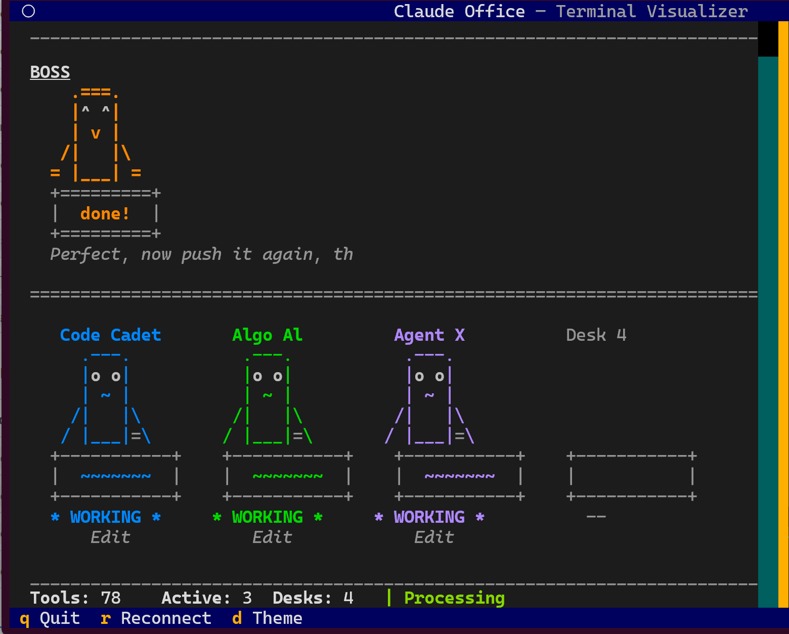

# TUI Claude Office


A terminal-based office visualizer for Claude Code. Watch your AI agents work in real-time as ASCII pixel-art characters sitting at desks, typing away at tasks.

## Screenshot



## Specs

| Spec | Value |
|------|-------|
| Max concurrent agents | 8 |
| Default desk count | 8 (dynamically grows in rows of 4) |
| Agent color palette | 8 unique colors |
| Max context tokens tracked | 200,000 |
| Event log capacity | 300 lines |
| WebSocket reconnect | Auto-retry with exponential backoff (2s-10s) |
| Backend | FastAPI + SQLite |
| TUI framework | Textual + Rich |
| Render refresh rate | 250ms (4 FPS) |

## Agent States

Agents cycle through 11 visual states during their lifecycle:

| State | Display | Description |
|-------|---------|-------------|
| `arriving` | `> ARRIVING >` | Agent spawned, entering via elevator |
| `reporting` | `^ REPORT ^` | Reporting to the boss |
| `walking_to_desk` | `> WALKING >` | Walking from boss to assigned desk |
| `working` | `* WORKING *` | Actively executing a tool |
| `thinking` | `. THINKING .` | Processing between tool calls |
| `waiting` | `~ WAITING ~` | Idle, waiting for input |
| `waiting_permission` | `? PENDING ?` | Waiting for user permission |
| `completed` | `! DONE !` | Task finished |
| `reporting_done` | `^ REPORT ^` | Reporting results back to boss |
| `leaving` | `< LEAVING <` | Walking to elevator to depart |
| `in_elevator` | — | Inside elevator, about to exit |

## Boss States

The boss character reflects Claude's main session activity:

| State | Description |
|-------|-------------|
| `idle` | No active work (sleeping `z z` eyes) |
| `phone_ringing` | Incoming user prompt |
| `on_phone` | Processing user input |
| `receiving` | Receiving agent reports |
| `working` | Actively coding (`* *` eyes) |
| `delegating` | Spawning subagents (`> >` eyes) |
| `waiting_permission` | Awaiting user approval (`? ?` eyes) |
| `reviewing` | Reviewing agent output (`- -` eyes) |
| `completing` | Task finished (`^ ^` eyes) |

## Tracked Events

The office responds to 19 event types from Claude Code hooks:

| Event | What it triggers |
|-------|-----------------|
| `session_start` / `session_end` | Office opens/closes |
| `subagent_start` | Agent spawns at elevator |
| `subagent_info` | Links native agent ID |
| `subagent_stop` | Agent departs via elevator |
| `pre_tool_use` / `post_tool_use` | Agent works at desk, tool counter increments |
| `user_prompt_submit` | Boss phone rings |
| `permission_request` | Agent enters pending state |
| `context_compaction` | Context bar resets |
| `notification` | Event log entry |
| `agent_update` | Agent state/bubble update |
| `background_task_notification` | Background task status |
| `error` | Error logged in sidebar |

## Features

- ASCII pixel-art office with boss and agent characters
- Real-time agent visualization via WebSocket
- Agents spawn at the elevator, walk to desks, and work on tasks
- Boss character reflects Claude's main session state
- Context utilization bar with color coding (green/yellow/red)
- Tool use counter with processing spinner
- Event log sidebar with color-coded entries
- Session targeting via `--session` flag or `CLAUDE_SESSION_ID` env var
- Auto-detect active session when no session specified
- Dynamic desk grid that grows as agents are added
- Dark/light theme toggle

## Quick Start

### Prerequisites

- Python 3.12+
- [uv](https://docs.astral.sh/uv/) package manager

### Installation

```bash
make install
```

### Running

**Terminal 1 — Start the backend:**
```bash
make backend
```

**Terminal 2 — Start the TUI:**
```bash
make tui
```

Or connect to a specific session:
```bash
cd tui && uv run python office.py --session <SESSION_ID>
```

The TUI can also pick up the session automatically via the `CLAUDE_SESSION_ID` environment variable.

### Simulating Agents

Test the office with simulated agents without needing a real Claude session:

```bash
# Basic agent lifecycle — spawn, work, complete (~60s)
make simulate

# Single agent pathfinding test — full elevator-to-desk-to-departure cycle
make test-agent
```

Three built-in simulation scenarios:

| Scenario | Duration | What it tests |
|----------|----------|---------------|
| `basic` | ~60s | Single agent: spawn, tool use, completion |
| `complex` | ~5-10min | Multi-agent workflow with context compaction |
| `edge_cases` | ~2min | Tool errors, orphan cleanup, permission requests |

Run a specific scenario:
```bash
uv run python scripts/simulate_events.py basic
uv run python scripts/simulate_events.py complex
uv run python scripts/simulate_events.py edge_cases
```

## Project Structure

```
backend/          # FastAPI backend — WebSocket server, REST API, SQLite state
  app/
    api/          # Route handlers (events, sessions, preferences)
    core/         # State machine, event processing, handlers
    db/           # SQLite database models
    models/       # Pydantic models (agents, events, sessions)
tui/              # Terminal UI — Textual app with Rich rendering
hooks/            # Claude Code hooks — capture real agent events
scripts/          # Simulation scenarios and test scripts
```

## Hooks

Install the Claude Code hooks to capture real agent events from your sessions:

```bash
make hooks-install
```

Manage hooks:
```bash
make hooks-status        # Show installed hooks
make hooks-logs          # View recent hook logs
make hooks-logs-follow   # Tail hook logs
make hooks-debug-on      # Enable debug logging
make hooks-debug-off     # Disable debug logging
make hooks-uninstall     # Remove hooks
make hooks-reinstall     # Reinstall hooks
```

## Keybindings

| Key | Action |
|-----|--------|
| `q` | Quit |
| `r` | Reconnect to session |
| `d` | Toggle dark/light theme |
| `j` / `k` | Scroll down/up |
| `Down` / `Up` | Scroll down/up |

## API Endpoints

The backend exposes a REST API at `http://localhost:8000`:

| Method | Endpoint | Description |
|--------|----------|-------------|
| `GET` | `/api/v1/sessions` | List all sessions |
| `GET` | `/api/v1/sessions/{id}/replay` | Replay session events and states |
| `PATCH` | `/api/v1/sessions/{id}/label` | Update session label |
| `DELETE` | `/api/v1/sessions/{id}` | Delete a session |
| `DELETE` | `/api/v1/sessions` | Clear all sessions |
| `POST` | `/api/v1/events` | Submit an event |
| `WS` | `/ws/{session_id}` | WebSocket for real-time state updates |
| `GET` | `/health` | Health check |

## License

MIT
