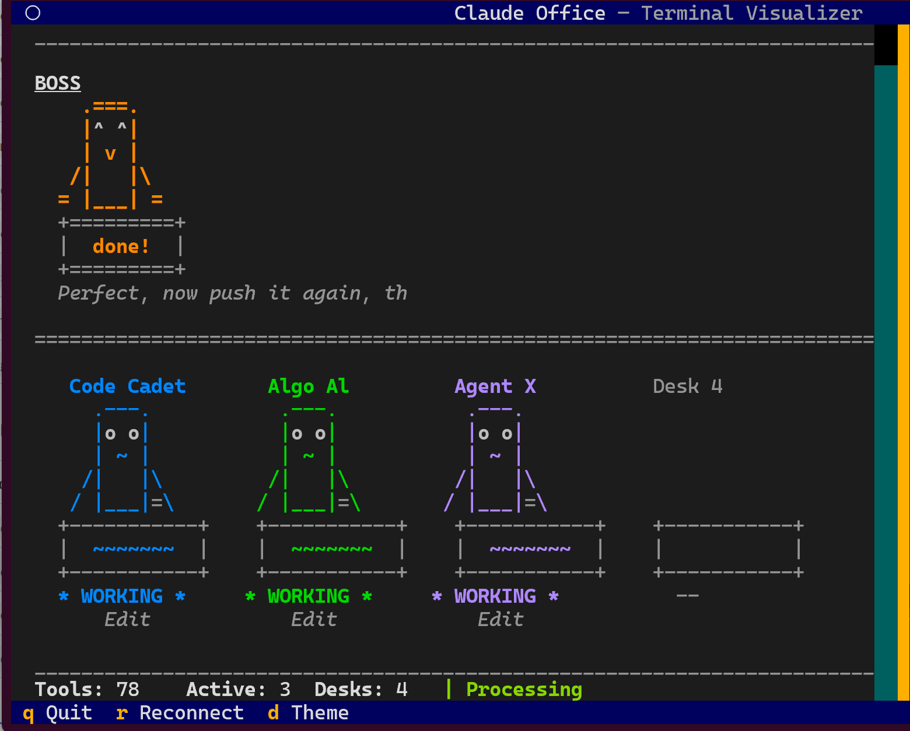

<div align="center">

# TUI Claude Office

**Watch your Claude Code agents work as ASCII pixel-art characters in a live terminal office** — subagents ride the elevator in, report to the boss, walk to a desk, and type away, all driven in real time by Claude Code hooks.


<br>



</div>

---

TUI Claude Office is a terminal visualizer for [Claude Code](https://claude.ai/code) sessions. A FastAPI backend ingests events from Claude Code hooks over a REST + WebSocket API, runs them through a state machine, and streams agent and boss states to a [Textual](https://textual.textualize.io/) + [Rich](https://rich.readthedocs.io/) terminal UI that renders an animated pixel-art office. It's built for anyone running multi-agent Claude Code workflows who wants an at-a-glance, ambient view of what their agents are actually doing.

The office reacts to real work: agents spawn at the elevator, report to the boss, walk to assigned desks, and switch between working/thinking/waiting states as tools fire — while a context-utilization bar, tool-use counter, and event-log sidebar track the session. No real session? A built-in simulator drives the whole thing with scripted scenarios.

## Features

- ASCII pixel-art office with a boss and up to 8 concurrent agent characters
- Real-time agent visualization over WebSocket, with auto-reconnect (exponential backoff)
- Agents spawn at the elevator, walk to desks, and work on tasks; the boss reflects the main session state
- Context-utilization bar with color coding (green/yellow/red) and a tool-use counter with spinner
- Event-log sidebar with color-coded entries
- Session targeting via `--session` flag or `CLAUDE_SESSION_ID`, or auto-detect of the active session
- Dynamic desk grid that grows in rows of 4 as agents are added
- Dark/light theme toggle

## Specs

| Spec | Value |
|------|-------|
| Max concurrent agents | 8 |
| Default desk count | 8 (grows in rows of 4) |
| Agent color palette | 8 unique colors |
| Max context tokens tracked | 200,000 |
| Event log capacity | 300 lines |
| WebSocket reconnect | Auto-retry with exponential backoff (2s–10s) |
| Backend | FastAPI + SQLite |
| TUI framework | Textual + Rich |
| Render refresh rate | 250ms (4 FPS) |

## Quick Start

### Prerequisites

- Python 3.12+
- [uv](https://docs.astral.sh/uv/) package manager

### Install

```bash
make install
```

### Run

**Terminal 1 — start the backend:**
```bash
make backend
```

**Terminal 2 — start the TUI:**
```bash
make tui
```

Or connect to a specific session:
```bash
cd tui && uv run python office.py --session <SESSION_ID>
```

The TUI can also pick up the session automatically via the `CLAUDE_SESSION_ID` environment variable.

## Hooks

Install the Claude Code hooks to capture real agent events from your sessions:

```bash
make hooks-install
```

Manage them with `make hooks-status`, `hooks-logs`, `hooks-logs-follow`, `hooks-debug-on`/`hooks-debug-off`, `hooks-uninstall`, and `hooks-reinstall`.

## Simulating Agents

Test the office without a real Claude session:

```bash
make simulate      # basic agent lifecycle — spawn, work, complete (~60s)
make test-agent    # single-agent pathfinding — full elevator→desk→departure cycle
```

Three built-in scenarios:

| Scenario | Duration | What it tests |
|----------|----------|---------------|
| `basic` | ~60s | Single agent: spawn, tool use, completion |
| `complex` | ~5-10min | Multi-agent workflow with context compaction |
| `edge_cases` | ~2min | Tool errors, orphan cleanup, permission requests |

Run a specific one:
```bash
uv run python scripts/simulate_events.py basic
uv run python scripts/simulate_events.py complex
uv run python scripts/simulate_events.py edge_cases
```

## Agent & Boss States

Agents cycle through 11 visual states across their lifecycle:

| State | Display | Description |
|-------|---------|-------------|
| `arriving` | `> ARRIVING >` | Agent spawned, entering via elevator |
| `reporting` | `^ REPORT ^` | Reporting to the boss |
| `walking_to_desk` | `> WALKING >` | Walking from boss to assigned desk |
| `working` | `* WORKING *` | Actively executing a tool |
| `thinking` | `. THINKING .` | Processing between tool calls |
| `waiting` | `~ WAITING ~` | Idle, waiting for input |
| `waiting_permission` | `? PENDING ?` | Waiting for user permission |
| `completed` | `! DONE !` | Task finished |
| `reporting_done` | `^ REPORT ^` | Reporting results back to boss |
| `leaving` | `< LEAVING <` | Walking to elevator to depart |
| `in_elevator` | — | Inside elevator, about to exit |

The boss character reflects Claude's main-session activity across 9 states — `idle`, `phone_ringing`, `on_phone`, `receiving`, `working`, `delegating`, `waiting_permission`, `reviewing`, and `completing` — each with its own eyes (e.g. sleeping `z z`, working `* *`, delegating `> >`).

## Tracked Events

The office responds to 19 event types from Claude Code hooks, including:

| Event | What it triggers |
|-------|-----------------|
| `session_start` / `session_end` | Office opens/closes |
| `subagent_start` / `subagent_stop` | Agent spawns at / departs via elevator |
| `subagent_info` | Links native agent ID |
| `pre_tool_use` / `post_tool_use` | Agent works at desk, tool counter increments |
| `user_prompt_submit` | Boss phone rings |
| `permission_request` | Agent enters pending state |
| `context_compaction` | Context bar resets |
| `notification` | Event-log entry |
| `agent_update` | Agent state/bubble update |
| `background_task_notification` | Background task status |
| `error` | Error logged in sidebar |

## Keybindings

| Key | Action |
|-----|--------|
| `q` | Quit |
| `r` | Reconnect to session |
| `d` | Toggle dark/light theme |
| `j` / `k` or `Down` / `Up` | Scroll |

## API

The backend exposes a REST + WebSocket API at `http://localhost:8000`:

| Method | Endpoint | Description |
|--------|----------|-------------|
| `GET` | `/api/v1/sessions` | List all sessions |
| `GET` | `/api/v1/sessions/{id}/replay` | Replay session events and states |
| `PATCH` | `/api/v1/sessions/{id}/label` | Update session label |
| `DELETE` | `/api/v1/sessions/{id}` | Delete a session |
| `DELETE` | `/api/v1/sessions` | Clear all sessions |
| `POST` | `/api/v1/events` | Submit an event |
| `WS` | `/ws/{session_id}` | WebSocket for real-time state updates |
| `GET` | `/health` | Health check |

## Project Structure

```
backend/          # FastAPI backend — WebSocket server, REST API, SQLite state
  app/
    api/          # Route handlers (events, sessions, preferences)
    core/         # State machine, event processing, handlers
    db/           # SQLite database models
    models/       # Pydantic models (agents, events, sessions)
tui/              # Terminal UI — Textual app with Rich rendering
hooks/            # Claude Code hooks — capture real agent events
scripts/          # Simulation scenarios and test scripts
```

## License

MIT — see [LICENSE](LICENSE).
